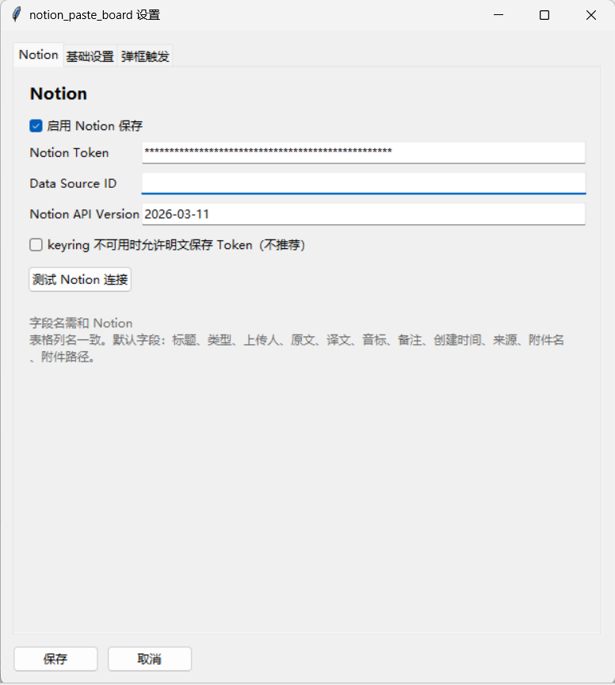
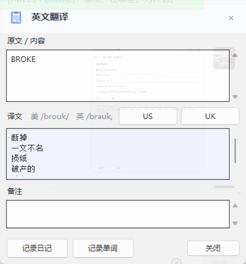
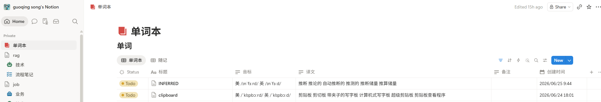

# notion_paste_board

Windows 剪贴板到 Notion 的轻量助手。

## 主要功能

- 复制英文后自动弹出翻译窗口。
- 支持译文、音标、US/UK 发音和备注。
- 支持一键记录到 Notion。
- 复制中文、文件或其他非英文内容时，只显示右下角小图标，点击后再展开。
- 不需要服务端，客户端直接写入 Notion。
- 支持系统托盘、暂停监控、恢复监控和退出。
- 支持打包为 Windows EXE。

## 软件截图







## 运行

```bat
pythonw client.py
```

## 打包 EXE

```bat
build_exe.bat
```

生成位置：

```text
dist\notion_paste_board\notion_paste_board.exe
```

如果生成目录里有 `_internal` 文件夹，不要删除。它是 PyInstaller 生成的运行依赖目录，需要和 exe 放在一起。

## Notion 配置

1. 在 Notion 创建一个 Internal Integration。
2. 复制 Integration Token，填到软件设置页的 Notion Token。
3. 打开目标 Notion 数据库，在右上角 Connections 里添加该 Integration。
4. 复制数据库的 Data Source ID，填到软件设置页。
5. 点击“测试 Notion 连接”。

推荐 Notion 字段：

| 字段名 | 类型 |
|---|---|
| 标题 | Title |
| 类型 | Select |
| 上传人 | Rich Text |
| 原文 | Rich Text |
| 译文 | Rich Text |
| 音标 | Rich Text |
| 备注 | Rich Text |
| 创建时间 | Date |
| 来源 | Rich Text 或 Select |
| 附件名 | Rich Text |
| 附件路径 | Rich Text 或 URL |

## 默认设置

- 软件名：`notion_paste_board`
- 弹框宽度：`400`
- 弹框透明度：`0.85`
- 自动关闭：`6000ms`
- 设置页签：`Notion`、`基础设置`、`弹框触发`

## 常见问题

### Notion 404

通常是 Data Source ID 填错，或者数据库没有授权给 Integration。

### 字段类型错误

请检查 Notion 字段名和字段类型是否匹配。

### 运行新版前

请先从系统托盘退出旧版程序，避免多个客户端同时监听剪贴板。
